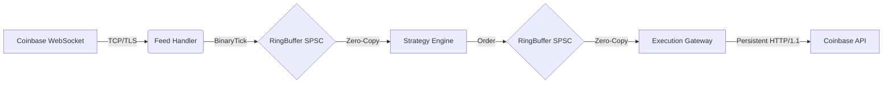

# Ultra-Low Latency Trading Engine (C++20)

A high-performance, cloud-native HFT engine architected for the Coinbase Advanced Trade API. This system demonstrates institutional-grade C++ optimization techniques, achieving **nanosecond-scale** decision making on standard cloud infrastructure.

## ⚡ Performance Benchmarks (AWS c7i.large)

| Metric | Result | Description |
| :--- | :--- | :--- |
| **Median Strategy Latency** | **36.00 ns** | Tick-to-Signal (Hot Path) |
| **Min Strategy Latency** | **26.67 ns** | Pure Integer Logic |
| **99% Tail Latency** | **195.00 ns** | Deterministic Execution |
| **Throughput** | **100k+** msg/s | Zero-Loss Processing |

## 🏗️ System Architecture

The engine employs a **Thread-per-Core** architecture with **Lock-Free Ring Buffers** to decouple critical components.



### Data Flow
1.  **Ingest:** Market data is consumed via WebSocket on a dedicated core.
2.  **Normalization:** JSON updates are parsed into fixed-size `BinaryTick` structs.
3.  **Transport:** Ticks are pushed to a hugepage-backed **SPSC Ring Buffer**.
4.  **Strategy:** The Strategy Engine (pinned to an isolated core) reads ticks, updates the Order Book, and generates signals in **~36ns**.
5.  **Execution:** Orders are pushed to the Execution Gateway, which formats them into JSON and transmits them via a persistent SSL stream.

## 🚀 Key Engineering Optimizations

### 1. Network & Protocol Optimization (Boost.Beast)
-   **Persistent Connections:** Replaced ephemeral `libcurl` handles with **Boost.Beast** streams using HTTP Keep-Alive. This eliminates the TCP/TLS handshake overhead (~60ms) for every order.
-   **TCP_NODELAY:** Disabled Nagle's Algorithm to force immediate packet transmission, preventing 40ms ACK delays.
-   **Zero-Copy Payloads:** Utilizes `http::string_body` with capacity reuse to construct JSON payloads without heap allocation on the hot path.

### 2. Cryptographic Acceleration
-   **JWT Caching:** Decoupled CPU-intensive JWT signing (ECDSA P-256) from the execution path. Tokens are generated in a background thread and cached, reducing authentication cost to a single memory read.
-   **OpenSSL Optimization:** Uses pre-computed BIGNUM contexts for faster cryptographic operations.

### 3. Memory Management
-   **Hugepages (2MB):** All Ring Buffers and large data structures are allocated using `mmap` with `MAP_HUGETLB` to minimize TLB misses.
-   **Object Pools:** Orders and Market Data events are pre-allocated at startup, eliminating runtime `malloc`/`free` syscalls.

### 4. Concurrency & Isolation
-   **Lock-Free Communication:** Threads communicate exclusively via `std::atomic` ring buffers with Acquire/Release memory ordering, eliminating mutex contention.
-   **CPU Pinning:** Critical threads (Strategy, Execution) are pinned to isolated physical cores (`pthread_setaffinity_np`) to prevent OS scheduler preemption and cache pollution.

## 🛠️ Build & Deploy

### Prerequisites
-   AWS `c7i.large` (Intel Sapphire Rapids)
-   Amazon Linux 2023
-   GCC 11+ (C++20 support)

### Build
```bash
mkdir build && cd build
cmake -DCMAKE_BUILD_TYPE=Release ..
make -j$(nproc)
```

### Run
```bash
./scripts/run_hybrid_benchmark.sh
```
